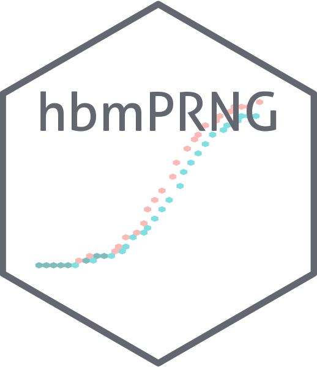

<!-- README.md is generated from README.Rmd. Please edit that file -->

```{r, include = FALSE}
knitr::opts_chunk$set(
  collapse = TRUE,
  comment = "#>",
  fig.path = "man/figures/README-",
  out.width = "100%"
)
```

# Hash-Based Matching Pseudo-Random Number Generation <a href='https://package.epinowcast.org'></a>

[](https://www.tidyverse.org/lifecycle/#experimental)
[](https://github.com/epinowcast/epinowcast/actions/workflows/R-CMD-check.yaml) [](https://app.codecov.io/gh/pearsonca/hbmPRNG)

[](https://github.com/pearsonca/hbmPRNG/blob/master/LICENSE.md/)
[](https://github.com/pearsonca/hbmPRNG/graphs/contributors)

Helper functions for use of hash-based matching (HBM) for pseudo-random number generation (PRNG) in stochastic simulations. HBM-PRNG is an approach to simplify matching synthetic experiment samples, which ensures that matched runs different only in the focal parameters, not in their chance events.

## Getting started and learning more

This README is a good place to get started with `hbmPRNG`, in particular the following installation and quick start sections. As you make use of the package, or if your problem requires a richer feature set than presented here, we also provide a range of other reosources.

- [Package website](): This includes a function reference, model outline, and case studies making use of the package. This site refers to the release version of our package. The development version of our documentation (corresponding to our `main` branch on GitHub) is available [here]().

## Installation

### Installing the package

Install the development version (whilst we strive to limit breaking changes or the introduction of bugs during development this version may contain both) from GitHub using the following,

```{r, eval = FALSE}
remotes::install_github("pearsonca/hbmPRNG", dependencies = TRUE)
```

## Quick start

In this quick start ...

## Citation

If you use `hbmPRNG` in your work, please consider citing it using the following,

```{r, echo = FALSE}
citation("hbmPRNG")
```

## How to make a bug report or feature request

Please briefly describe your problem and what output you expect in an [issue](https://github.com/pearsonca/hbmPRNG/issues). If you have a question, please don't open an issue. Instead, ask on our [Q and A page](https://github.com/pearsonca/hbmPRNG/discussions/categories/q-a). See our [contributing guide](https://github.com/pearsonca/hbmPRNG/blob/main/CONTRIBUTING.md) for more information.

## Contributing

We welcome contributions and new contributors! We particularly appreciate help on priority problems in the [issues](https://github.com/pearsonca/hbmPRNG/issues). Please check and add to the issues, and/or add a [pull request](https://github.com/pearsonca/hbmPRNG/pulls). See our [contributing guide](https://github.com/pearsonca/hbmPRNG/blob/main/CONTRIBUTING.md) for more information.

## Code of Conduct

Please note that the hbmPRNG project is released with a [Contributor Code of Conduct](https://contributor-covenant.org/version/2/1/CODE_OF_CONDUCT.html). By contributing to this project, you agree to abide by its terms.